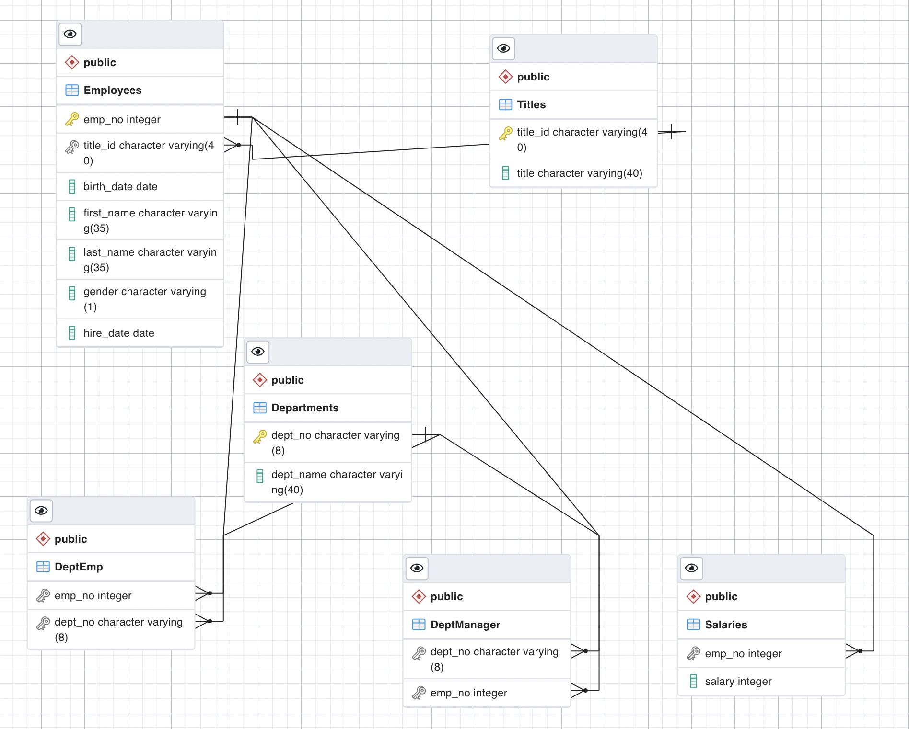

# SQL-Challenge
In this assignment I was tasked with Modeling, Engineering, and Analyzing a set of data. This script designs the tables to hold the data from the CSVs, imports the SCVs into an SQL database, and then answeres some questions about the data.

## Data Modeling:
To model the data I inspected the CSVs and sketched out an ERD of the tables.

## Data Engineering:
- Used information given to create a table scheme for each of the six CSV files. Specifies data types, primary keys, foreign keys, and other constraints.
- Imported each CSV file into corresponding SQL table

## Data Analysis:
After completing the database, the following was done:
   -  List the following details of each employee: employee number, last name, first name, sex and salary
   -  List employees who were hired in 1986
   -  List the manager of each department with the following info: department number, department name, manager's employee number, last name, first name
   -  List the department of each employee with the following info: employee number, last name, first name, and department name
   -  List all employees whose first name is 'Hercules' and last name begins with 'B'.
   -  List all employees in the sales department, including their employee number, first name, last name, and department name
   -  List all employees in the sales and development department, including their employee number, first name, last name, and department name
   -  In descending order, list the frequency count of employee last names.
